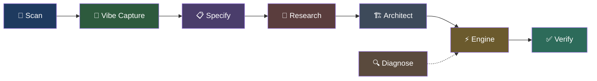

# 🧬 Steroid-Workflow

[](https://www.npmjs.com/package/steroid-workflow)
[](LICENSE)
[](https://nodejs.org)
[](https://github.com/nzkbuild/steroid-workflow/actions/workflows/ci.yml)

**AI coding guardrails that enforce a structured pipeline — so the AI can't cut corners, skip steps, or hallucinate solutions.**

Steroid-Workflow wraps your AI coding assistant in an 8-phase pipeline with physical enforcement. Every idea flows through codebase scanning, specification, research, architecture, TDD implementation, and verification — producing enterprise-grade output with documentation, CI/CD, error handling, and deployment guidance.

## The Problem

AI coding tools are powerful but unreliable. Without guardrails, they:
- Skip planning and jump straight to code
- Forget requirements halfway through
- Write fake tests that always pass
- Silently delete working code during refactors
- Produce weekend-hackathon quality output for production projects

Steroid-Workflow makes these failures **physically impossible** through git hooks, gate checks, and circuit breakers.

## Quick Start

```bash
# 1. Inside any project with git init
npx steroid-workflow init

# 2. Tell your AI what to build
> "Build me a habit tracker like Apple Health"

# 3. The AI automatically follows the pipeline
#    If it doesn't, say: "Use the steroid pipeline."
```

No config. No dependencies. Works with any AI-powered IDE.

## How It Works



| Phase | What Happens | Output |
|-------|-------------|--------|
| **Scan** | Detects tech stack, project structure, test infra | `context.md` |
| **Vibe Capture** | Translates your idea into a structured brief | `vibe.md` |
| **Specify** | Converts the brief into user stories with acceptance criteria | `spec.md` |
| **Research** | Investigates tech choices, security, deployment, architecture | `research.md` |
| **Architect** | Creates atomic execution plan with quality, docs, and deploy tasks | `plan.md` |
| **Engine** | Builds using TDD, commits atomically, captures learnings | Working code |
| **Verify** | Runs core verification by default, with optional deep scans for code smells and licenses | `verify.md`, `verify.json` |
| **Diagnose** | Root cause analysis for bugs (fix intent only) | `diagnosis.md` |

Each phase hands off to the next. No manual intervention needed.

### Smart Intent Routing

You don't need to tell the AI which pipeline to use — it detects your intent automatically:

| You Say | Pipeline |
|---------|----------|
| "Build a dashboard" | scan → vibe → spec → research → architect → engine → verify |
| "Fix the login bug" | scan → diagnose → targeted fix → verify |
| "Refactor the API" | scan → specify target state → architect → engine → verify |
| "Upgrade to React 19" | scan → research → architect → engine → verify |
| "Document the API" | scan → specify → engine → verify |

### Prompt Intelligence

Before the workflow commits to a path, steroid-workflow can normalize messy user language into a structured brief:

- `node steroid-run.cjs normalize-prompt "<message>"` — infer intent, ambiguity, complexity, assumptions, and recommended route
- `node steroid-run.cjs prompt-health "<message>"` — score clarity, completeness, ambiguity, and risk
- `node steroid-run.cjs session-detect` — detect whether this looks like new work, continuation, or post-failure recovery

This helps with vague prompts, mixed prompts, non-technical phrasing, and continuation requests like "continue what we were doing yesterday."

Once written, `.memory/changes/<feature>/prompt.json` becomes the machine-readable receipt and `.memory/changes/<feature>/prompt.md` becomes the readable handoff brief. The later phases can preserve assumptions, non-goals, continuation context, and recommended route instead of forcing every model to reconstruct them from scratch.

## What You Get

### Your AI Can't Skip Steps
A **git pre-commit hook** blocks any code commit unless the AI went through the pipeline. IDE config injection ensures every AI model sees the rules first.

### Errors Stop Before They Snowball
A **5-level circuit breaker** tracks command failures. At level 1, the AI retries. By level 4, it stops and presents the error history for human review. At level 5, execution is halted entirely.

### Proof Your Code Matches the Spec
A **two-stage review** system checks (1) whether the AI built what was requested and (2) whether it's well-built. Both stages must pass before core verification can succeed, and archive now depends on a machine-readable verification receipt.

### Enterprise-Grade Output
Every project automatically includes:
- README, CHANGELOG, and deployment documentation
- Error boundaries, loading states, input validation
- Security considerations and dependency auditing
- CI/CD workflow (GitHub Actions)
- License audit (flags GPL/AGPL viral licenses)
- Code comments following explain-why-not-what standards

### AI Safety Guardrails
Protections specifically designed for non-technical users:
- **Adaptive Discussion** — AI detects your technical level
- **Prompt Intelligence** — vague, mixed, and non-technical prompts are normalized into explicit assumptions, non-goals, and recommended routes
- **Prompt Preservation** — your exact requirements survive the entire pipeline
- **Brownfield Detection** — won't scaffold over your existing project
- **Anti-Deletion Guard** — can't silently remove working code
- **True TDD Guard** — fake tests like `expect(true).toBe(true)` are blocked
- **Anti-Loop Directive** — stops the AI from guessing the same broken fix repeatedly
- **Optional Deep Verification** — `verify-feature --deep` can run `knip`, `madge`, `gitleaks`, and license checks when you want extra scrutiny
- **Command Allowlist** — only known dev commands can execute through the circuit breaker

## Language Support

| Language | Scan | Build | Lint | Test |
|----------|------|-------|------|------|
| JavaScript/TypeScript | ✅ | `npm run build` | `eslint` | `npm test` |
| Python | ✅ | `py_compile` | `flake8`/`ruff` | `pytest` |
| Rust | ✅ | `cargo build` | `cargo clippy` | `cargo test` |
| Go | ✅ | `go build` | `golangci-lint` | `go test` |
| Java/Kotlin | ✅ | `mvn`/`gradle` | `checkstyle` | `mvn test` |
| Ruby | ✅ | — | `rubocop` | `rspec` |
| PHP | ✅ | — | `phpstan` | `phpunit` |
| C#/.NET | ✅ | `dotnet build` | — | `dotnet test` |
| Dart/Flutter | ✅ | `flutter build` | `dart analyze` | `flutter test` |

## Supported IDEs

Works with any AI-powered IDE or CLI:

| IDE | Config |
|-----|--------|
| Gemini CLI / Antigravity | `GEMINI.md` |
| Cursor | `.cursorrules` |
| Claude Code | `CLAUDE.md` |
| OpenAI Codex | `AGENTS.md` |
| GitHub Copilot | `.github/copilot-instructions.md` |
| Windsurf | `.windsurfrules` |
| Cline | `.clinerules` |
| Aider | `.agents/steroid-maestro.md` |

All configs are auto-generated during install.

## Update

```bash
npx steroid-workflow@latest update
```

Your project state (`.memory/`) is preserved. Only skills, configs, and enforcement layers are refreshed.

## Verify Installation

```bash
node steroid-run.cjs audit
```

Checks all enforcement layers: git hook, 8 skills, 7 gates, circuit breaker, IDE configs, and knowledge stores.

## For Power Users

See [ARCHITECTURE.md](ARCHITECTURE.md) for:
- Full command reference (22+ commands)
- Gate map and enforcement layer details
- Intent routing internals
- Prompt intelligence and adaptive route selection
- Memory system, review system, and analytics dashboard
- Fork credits and sources

## License

MIT © [nzkbuild](https://github.com/nzkbuild)
