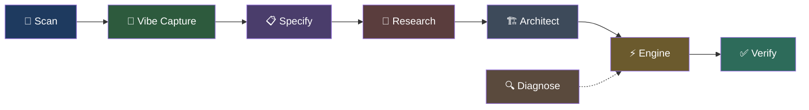

# 🧬 Steroid-Workflow

[](https://www.npmjs.com/package/steroid-workflow)
[](LICENSE)
[](https://nodejs.org)
[](https://github.com/nzkbuild/steroid-workflow/actions/workflows/ci.yml)

**AI coding guardrails with a governed runtime artifact spine — so the AI can't silently skip phases, fake receipts, or hand-wave completion.**

Steroid-Workflow now operates as a governed workflow runtime, not just a prompt-and-skill pack. The live repo enforces durable artifacts like `request.json`, `tasks.md`, `execution.json`, `verify.json`, and `completion.json`, and the runtime gates archive/report/verify behavior on those receipts instead of trusting loose markdown or assistant narration.

## The Problem

AI coding tools are powerful but unreliable. Without guardrails, they:

- Skip planning and jump straight to code
- Forget requirements halfway through
- Write fake tests that always pass
- Silently delete working code during refactors
- Produce weekend-hackathon quality output for production projects

Steroid-Workflow makes these failures **physically impossible** through git hooks, gate checks, and circuit breakers.

## Quick Start

```bash
# Stable
npx steroid-workflow init

# Beta
npx steroid-workflow@beta init

# Inside any project with git init, tell your AI what to build
> "Build me a habit tracker like Apple Health"

# If it drifts, say: "Use the steroid pipeline."
```

No config. Works with any AI-powered IDE. Beta is where the governed runtime hardening lands first.

## What Steroid Is Now

Steroid currently has three layers:

1. **Runtime enforcement**
   - `bin/steroid-run.cjs` physically enforces gates, receipts, archive rules, and command safety
2. **Governed live baseline**
   - `governed/` defines the live contract surfaces for transplanted subsystems
3. **Skills and IDE wiring**
   - `skills/` and generated agent instruction files teach assistants how to operate inside the runtime

The important shift is that the runtime now expects real artifacts, not just “the model said it did the step.”

## Current Live Artifact Spine

The main live governed path now produces and consumes these durable artifacts under `.memory/changes/<feature>/`:

- `request.json`
- `context.md`
- `prompt.json`
- `prompt.md`
- `vibe.md`
- `spec.md`
- `research.md`
- `plan.md`
- `tasks.md`
- `execution.json`
- `review.md`
- `review.json`
- `verify.md`
- `verify.json`
- `completion.json`

For UI-intensive features, Steroid can also govern:

- `design-routing.json`
- `design-system.md`
- `accessibility.json`
- `ui-audit.json`
- `ui-review.md`
- `ui-review.json`

These artifacts are not just logs. They drive gate, verify, report, and archive behavior.

## How It Works



| Phase            | What Happens                                                                             | Output                     |
| ---------------- | ---------------------------------------------------------------------------------------- | -------------------------- |
| **Scan**         | Detects tech stack, project structure, test infra                                        | `request.json`, `context.md` |
| **Vibe Capture** | Translates your idea into a structured brief                                             | `vibe.md`                  |
| **Specify**      | Converts the brief into user stories with acceptance criteria                            | `spec.md`                  |
| **Research**     | Investigates tech choices, security, deployment, architecture                            | `research.md`              |
| **Architect**    | Creates atomic execution plan with quality, docs, and deploy tasks                       | `plan.md`                  |
| **Engine**       | Builds using TDD, syncs task artifacts, and emits governed execution receipts            | Working code, `tasks.md`, `execution.json` |
| **Verify**       | Runs review + verification, refreshes UI evidence when relevant, and emits completion state | `review.md`, `review.json`, `verify.md`, `verify.json`, `completion.json` |
| **Diagnose**     | Root cause analysis for bugs (fix intent only)                                           | `diagnosis.md`             |

Each phase hands off to the next through artifacts. The important runtime rule is: later commands now block on missing or malformed governed artifacts instead of assuming previous work happened.

### Smart Intent Routing

You don't need to tell the AI which pipeline to use — it detects your intent automatically:

| You Say               | Pipeline                                                    |
| --------------------- | ----------------------------------------------------------- |
| "Build a dashboard"   | scan → vibe → spec → research → architect → engine → verify |
| "Fix the login bug"   | scan → diagnose → targeted fix → verify                     |
| "Refactor the API"    | scan → specify target state → architect → engine → verify   |
| "Upgrade to React 19" | scan → research → architect → engine → verify               |
| "Document the API"    | scan → specify → engine → verify                            |

### Prompt Intelligence

Before the workflow commits to a path, steroid-workflow can normalize messy user language into a structured brief:

- `node steroid-run.cjs normalize-prompt "<message>"` — infer intent, ambiguity, complexity, assumptions, and recommended route
- `node steroid-run.cjs prompt-health "<message>"` — score clarity, completeness, ambiguity, and risk
- `node steroid-run.cjs session-detect` — detect whether this looks like new work, continuation, or post-failure recovery

This helps with vague prompts, mixed prompts, non-technical phrasing, and continuation requests like "continue what we were doing yesterday."

Once written, `.memory/changes/<feature>/prompt.json` becomes the machine-readable receipt and `.memory/changes/<feature>/prompt.md` becomes the readable handoff brief. The later phases can preserve assumptions, non-goals, continuation context, and recommended route instead of forcing every model to reconstruct them from scratch.

## Internalized Frontend Systems

Steroid-Workflow now internalizes its frontend stack instead of depending on assistant-specific global installs. The imported source packs live in-repo as native Steroid capabilities:

- `ui-ux-pro-max`
- `Anthropic Frontend Design`
- `Vercel Web Design Guidelines`
- `Vercel React Best Practices`
- `Vercel Composition Patterns`
- `Bencium UX Designer`
- `AccessLint`
- `Vercel React Native Skills`

The goal is simple: users install Steroid once, then UI-intensive work automatically uses Steroid's internalized design system generation, implementation rules, and accessibility audits.

For runtime orchestration, use:

- `node steroid-run.cjs design-route "<message>" --feature <feature> --write` to persist `.memory/changes/<feature>/design-routing.json`
- `node steroid-run.cjs design-system --feature <feature> --write` to generate `.memory/changes/<feature>/design-system.md` from the imported `ui-ux-pro-max` source
- `node steroid-run.cjs design-prep "<message>" --feature <feature> --write` to generate both artifacts together in one step
- `node steroid-run.cjs verify-feature <feature>` to run AccessLint against local HTML targets, write `.memory/changes/<feature>/accessibility.json` when applicable, and refresh frontend review receipts from the latest verification evidence
- `node steroid-run.cjs verify-feature <feature> --deep` to also attempt a Playwright-backed browser audit and write `.memory/changes/<feature>/ui-audit.json` when a preview URL or local HTML target is available
- `node steroid-run.cjs verify-feature <feature> --deep --url <preview>` to explicitly point the browser audit at a preview URL and persist it to `.memory/changes/<feature>/preview-url.txt`
- `node steroid-run.cjs review ui <feature>` to refresh `.memory/changes/<feature>/ui-review.md` and `.memory/changes/<feature>/ui-review.json` from existing frontend evidence without rerunning the full verification command

For UI-intensive features, verification also writes `.memory/changes/<feature>/ui-review.md` and `.memory/changes/<feature>/ui-review.json`, frontend-focused summary artifacts that combine design-system alignment, accessibility evidence, browser-audit evidence, and the top UI risks in one place. The receipt records who refreshed it and which evidence triggered the refresh, and `pipeline-status`, handoff reports, and dashboard output surface that freshness data. If `ui-review.json` is `FAIL`, archive will stay blocked. `CONDITIONAL` frontend reviews now split into caution vs hold: polish-only issues warn, but accessibility violations or missing deep browser evidence after a deep verify request block archive unless you explicitly run `node steroid-run.cjs archive <feature> --force-ui`. `archive <feature>` and `report generate <feature>` also auto-refresh stale UI review receipts when newer frontend evidence exists, and `gate research` / `gate architect` / `gate engine` enforce the `design-routing.json` + `design-system.md` path for UI-intensive work.

## Governed Baseline

The live repo now carries governed baseline transplants under `governed/`. These are the law surfaces for the subsystems that have already been migrated out of pure markdown/skill authority:

- `governed/scan-system/`
- `governed/spec-system/`
- `governed/research-system/`
- `governed/execution-engine/`
- `governed/review-and-verify/`
- `governed/progress-memory/`
- `governed/core-runtime/`

Each governed slice includes:

- `MODULE.yaml`
- `LIVE-MAPPING.md`
- `PROVENANCE.md`
- `PARITY.md`
- example fixtures where needed

In other words: Steroid is no longer only “follow these docs.” Parts of it are now explicitly migrated into governed contract form.

## What You Get

### Your AI Can't Skip Steps

A **git pre-commit hook** blocks any code commit unless the AI went through the pipeline. IDE config injection ensures every AI model sees the rules first.

### Errors Stop Before They Snowball

A **5-level circuit breaker** tracks command failures. At level 1, the AI retries. By level 4, it stops and presents the error history for human review. At level 5, execution is halted entirely.

### Proof Your Code Matches the Spec

A **two-stage review** system checks (1) whether the AI built what was requested and (2) whether it's well-built. Both stages must pass before core verification can succeed, and archive now depends on a machine-readable verification receipt.

### Enterprise-Grade Output

Every project automatically includes:

- README, CHANGELOG, and deployment documentation
- Error boundaries, loading states, input validation
- Security considerations and dependency auditing
- Design-system-driven frontend guidance for UI-intensive features via Steroid's internalized frontend systems
- CI/CD workflow (GitHub Actions)
- License audit (flags GPL/AGPL viral licenses)
- Code comments following explain-why-not-what standards

### AI Safety Guardrails

Protections specifically designed for non-technical users:

- **Adaptive Discussion** — AI detects your technical level
- **Prompt Intelligence** — vague, mixed, and non-technical prompts are normalized into explicit assumptions, non-goals, and recommended routes
- **Prompt Preservation** — your exact requirements survive the entire pipeline
- **Brownfield Detection** — won't scaffold over your existing project
- **Anti-Deletion Guard** — can't silently remove working code
- **True TDD Guard** — fake tests like `expect(true).toBe(true)` are blocked
- **Anti-Loop Directive** — stops the AI from guessing the same broken fix repeatedly
- **Optional Deep Verification** — `verify-feature --deep` can run a Playwright-backed browser audit plus `knip`, `madge`, `gitleaks`, and license checks when the required local tools are available. Steroid will try `--url`, deploy env vars, common `.env*` files, project preview receipts, feature preview receipts, `package.json` preview metadata, and local HTML targets in that order.
- **Command Allowlist** — only known dev commands can execute through the circuit breaker
- **Governed Receipt Enforcement** — archive/report/verify now block on missing or malformed runtime receipts rather than trusting assistant claims

## Beta Status

`6.3.x beta` is the governed runtime hardening line.

That beta work includes:

- governed live baseline transplants
- stronger runtime receipt enforcement
- safer command execution and project-boundary confinement
- extracted, directly tested runtime helper modules under `src/utils/`

Use the beta if you want the more explicit artifact model and stricter runtime behavior earlier than stable.

## Language Support

| Language              | Scan | Build           | Lint            | Test           |
| --------------------- | ---- | --------------- | --------------- | -------------- |
| JavaScript/TypeScript | ✅   | `npm run build` | `eslint`        | `npm test`     |
| Python                | ✅   | `py_compile`    | `flake8`/`ruff` | `pytest`       |
| Rust                  | ✅   | `cargo build`   | `cargo clippy`  | `cargo test`   |
| Go                    | ✅   | `go build`      | `golangci-lint` | `go test`      |
| Java/Kotlin           | ✅   | `mvn`/`gradle`  | `checkstyle`    | `mvn test`     |
| Ruby                  | ✅   | —               | `rubocop`       | `rspec`        |
| PHP                   | ✅   | —               | `phpstan`       | `phpunit`      |
| C#/.NET               | ✅   | `dotnet build`  | —               | `dotnet test`  |
| Dart/Flutter          | ✅   | `flutter build` | `dart analyze`  | `flutter test` |

## Supported IDEs

Works with any AI-powered IDE or CLI:

| IDE                      | Config                            |
| ------------------------ | --------------------------------- |
| Gemini CLI / Antigravity | `GEMINI.md`                       |
| Cursor                   | `.cursorrules`                    |
| Claude Code              | `CLAUDE.md`                       |
| OpenAI Codex             | `AGENTS.md`                       |
| GitHub Copilot           | `.github/copilot-instructions.md` |
| Windsurf                 | `.windsurfrules`                  |
| Cline                    | `.clinerules`                     |
| Aider                    | `.agents/steroid-maestro.md`      |

All configs are auto-generated during install.

## Update

```bash
npx steroid-workflow@latest update

# or beta
npx steroid-workflow@beta update
```

Your project state (`.memory/`) is preserved. Only skills, configs, and enforcement layers are refreshed.

## Verify Installation

```bash
node steroid-run.cjs audit
```

Checks all enforcement layers: git hook, 8 skills, 7 gates, circuit breaker, IDE configs, and knowledge stores.

## For Power Users

See [ARCHITECTURE.md](ARCHITECTURE.md) for:

- Full command reference (22+ commands)
- Gate map and enforcement layer details
- Intent routing internals
- Prompt intelligence and adaptive route selection
- Memory system, review system, and analytics dashboard
- Governed baseline and live artifact mapping
- Fork credits and sources

## License

MIT © [nzkbuild](https://github.com/nzkbuild)
